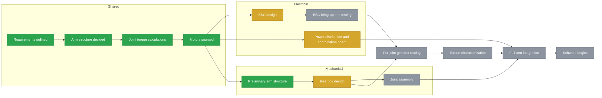

### Overview

MEC-Arm is a six degree of freedom robotic arm which is currently being designed from scratch by a 2 member team. The team is composed of a mechanical and electrical engineering student, working together to realize this personal project. The overall objective is to create a fully functional, precise, and practical arm, while creating many of the required components from scratch along the way. This repository contains both the mechanical and the electrical side of the project, after all, this is a **M**echanical **E**lectrical **C**ollaboration -Arm :)

Key Specs:

* 6 DOF arm
* 60cm reach
* 1 kg payload
* Battery powered

### Timeline

🟩 Done · 🟨 In progress · ⬜ Planned

### Electrical Hardware

The electrical hardware of this project is responsible to bring the arm to life, providing a way to reliably control the joints, and keep the whole system powered on and safe to use. The current MEC-arm design is expecting to use 7 brushless motors (varying depending on the joint), so the first element which is being worked on is a custom PCB capable of driving BLDCs. The other piece of electrical hardware which is being worked on is a general power distribution / converter board, which will be responsibel for ensuring all of the systems are properly being distributed their power correctly, and offers a main hub to connect the PC to all of the other electronics.

#### Electric Speed Controller (ESC)

The ESCs will play a critical role on the arm, being responsible for controlling all of the arm joints. The approach I want to take for these ESCs is to have them mounted behind the motors that they will be controlling. This is benefitial in many ways (both electrically and practically), but the main motivators for me is so that I can use a magnetic encoder on the motors input shaft (removing the necessity to couple an external encoder to the motor shaft), and this eliminates the nasty wiring which comes with externally mounted ESCs. The decision to use brushless motors was made so that we can extract as much torque as possible in a very small volume, and so we can take advantage of interesting control strategies such as FOC. With that said, here are the requirements for the ESC:

High Level Goals for the ESC:

* Compact driver must fit behind motor for each joint
* Must be able to run FOC
* Achieve smooth low speed position control with magnetic encoder feedback
* Generic use across all arm joints 
* Protected against overcurrent shutdown, under/overvoltage lockout, and over-temperature monitoring

