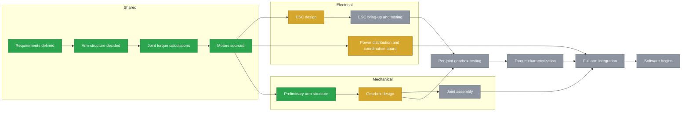

<h1>MEC-Arm</h1>

## Overview
MEC-Arm is a six degree of freedom robotic arm which is currently being designed from scratch by 2 students team. The team is composed of a mechanical and electrical engineering student, working together to realize this shared personal project. The overall objective is to create a fully functional, precise, and practical arm, while creating many of the required components from scratch along the way. This repository contains both the mechanical and the electrical side of the project, after all, this is a **M**echanical **E**lectrical **C**ollaboration -Arm :)

Find all the Documentation here: [MEC-Arm Documentation Page](https://j-di.github.io/MEC-arm/)

### Key Features:

#### Arm
- Joint layout: waist (roll), shoulder (pitch), elbow (pitch), 3-axis wrist (roll, pitch, roll)
- Arm weight: TBD
- End effector: gripper, driven by the 7th motor
- Max joint speed: 90 RPM (shoulder)

#### Actuation

- Actuators: 7× brushless motors with custom cycloidal gearboxes
- Gear ratios: 19:1, 25:1, 15:1
- Motor control: FOC at every joint
- Position feedback: on-board magnetic encoders

#### Power & control

- Battery: 6S LiPo, 25.2–18V, TBD mA
- Communication: CAN bus 
- Host: controlled from a raspberry pi

## Timeline

```mermaid
flowchart LR
    subgraph Shared
        A[Requirements defined]
        B[Arm structure decided]
        C[Joint torque calculations]
        D[Motors sourced]
    end

    subgraph Electrical
        E[ESC design]
        H[ESC bring-up and testing]
        P[Power distribution and coordination board]
    end

    subgraph Mechanical
        F[Preliminary arm structure]
        G[Gearbox design]
        I[Joint assembly]
    end

    K[Per-joint gearbox testing]
    L[Torque characterization]
    J[Full arm integration]
    S[Software begins]

    A --> B --> C --> D
    D --> E --> H
    D --> P
    D --> F --> G --> I
    H --> K
    G --> K
    K --> L
    L --> J
    I --> J
    P --> J
    J --> S

    classDef done fill:#2da44e,stroke:#1a7f37,color:#fff
    classDef wip  fill:#d4a72c,stroke:#9a6700,color:#fff
    classDef todo fill:#8c959f,stroke:#57606a,color:#fff
    class A,B,C,D,F done
    class E,G,P wip
    class H,I,J,K,L,S todo
```

🟩 Done · 🟨 In progress · ⬜ Planned
